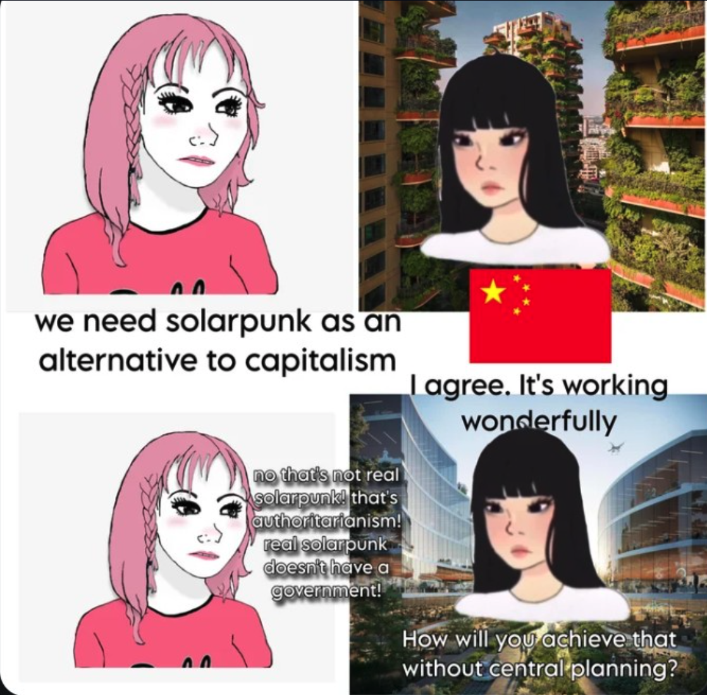
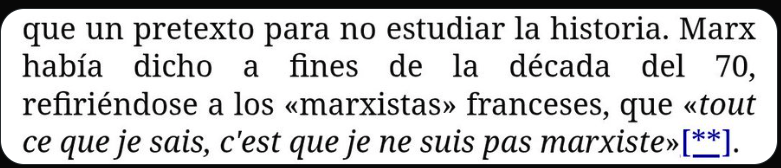

# Contexto

## Original Poster

[@GNortania](https://x.com/GNortania) · [May 28](https://x.com/GNortania/status/2059939289769578595)

> La peña os hacéis llamar comunistas pero luego le tenéis miedo y asco al concepto de comunas y comunidad organizada porque lo único que queréis es cambiar un estado por otro con colores diferentes y no un cambio real. Marx, Engels y Lenin os variarían un cargador en la pierna.

**Quote:**

**단일성 Commie on the Rez 단일성**  
[@patriach2051](https://x.com/patriach2051) · May 28

<ALT: pinkie-not-very-barbie-girl: "We need solarpunk as an alternative to capitalism". chinese-solar-punks-girl: "I agree. It's working wonderfully. Pinie girl again: "no that's not real solarpunk! that's authoritarism! real solarpunk doesn't have a government". chinese-girl again: "How will you achieve that without central planning=">

## Thread 1 — Comuna, infraestructura, Estado y Marx

[@Octaviots](https://x.com/Octaviots) · [4:01 PM - May 28, 2026](https://x.com/Octaviots/status/2059998469989781901)

> Como coño construyes infraestructura en una comuna? Se le llama marxismo leninismo porque Marx en si mismo era anarquista. Se necesita el leninismo porque la aplicación práctica del comunismo requiere de una estructura comunal masiva llamada estado.

[@GNortania](https://x.com/GNortania) · [May 28](https://x.com/GNortania/status/2060017434933784747)

> *"cómo cono construyes infraestructura en una comuna"* a través de una red de consejos obreros donde se toman las decisiones de barrio en barrio, lo que conocemos como Sóviets. 

> Llamar a Marx anarquista también es pa verlo

[@Octaviots](https://x.com/Octaviots) · [May 28](https://x.com/Octaviots/status/2060018581979398639)

> Una red de consejos obreros obreros, que a su vez ha de reunirse con otra red de consejos obreros, que a su vez ha de reunirse con... Porque la escala de la empresa a emprender es enorme, entonces necesitas designar representación para hacerlo d forma práctica, formando un estado

[@GNortania](https://x.com/GNortania) · [May 28](https://x.com/GNortania/status/2060019238274752643)

> Estaría genial lo que dices si no fuera porque tenemos capacidad de viajar de un lado al otro del mundo en cuestión de horas y comunicación inmediata. El estado socialista es necesario, si, pero como algo transitorio hacia su desaparición, como el dinero, la propiedad y la clase

[@Octaviots](https://x.com/Octaviots) · [May 28](https://x.com/Octaviots/status/2060019989579436351)

> Sigues necesitando representación para hacerlo viable, ya sea en inversión de tiempo o conocimientos necesarios, generando una superestructura. La abolición de los estados y todo lo ligado a ellos se podría decir que es la definición última del anarquismo. Lo que Marx era.

[@GNortania](https://x.com/GNortania) · [May 28](https://x.com/GNortania/status/2060020624362295339)

> La cosa es que la representación no depende de los votos que uno reciba si no de quiénes deciden participar, si quieres que el gobierno haga algo, presenta tu petición, si crees que no lo hacen bien, vuélvete el gobierno participando en las asambleas.

[@GNortania](https://x.com/GNortania) · [May 28](https://x.com/GNortania/status/2060020796181897348)

> Realmente no voy a debatir de nada con alguien que llama Anarquista a Marx.

[@_soda_vanilla_](https://x.com/_soda_vanilla_) · [May 28](https://x.com/_soda_vanilla_/status/2060088026676478371)

> ¿Marx anarquista? ¿El que expulsó a los anarquistas de la primer internacional? ¿El que tuvo una rivalidad con Bakunin? ¿El que escribió la pobreza de la filosofía? ¿El que criticó a Stirner? ¿Enserio de ese Marx hablamos?

[@Octaviots](https://x.com/Octaviots) · [May 29](https://x.com/Octaviots/status/2060210226754711924)

> Marx persigue como fin último la desaparición del estado, si o no? Los desacuerdos con el método y con el fin en si mismo son cosas muy diferentes.

[@TyranoFiccional](https://x.com/TyranoFiccional) · [May 29](https://x.com/TyranoFiccional/status/2060374978684723216)

> Pensar que el fin último de los anarquistas es la eliminación del estado es probablemente la caricatura hecha militancia

[@Octaviots](https://x.com/Octaviots) · [May 29](https://x.com/Octaviots/status/2060380317727211593)

> Yo diría que es bastante reduccionista, pero no es mentira. Por eso escribí fin último y no una disertación.

[@RadicalModerad2](https://x.com/RadicalModerad2) · [May 29](https://x.com/RadicalModerad2/status/2060246165388427437)

> Malditos comunaístas!

## Thread 2 — Marx, marxismo y "Marx no era marxista"

[@facu_az0gue](https://x.com/facu_az0gue) · [1:28 PM - May 29, 2026](https://x.com/facu_az0gue/status/2060322407403958642)

> el hecho de que Marx fuese marxista es una tremenda coincidencia

<ALT: La imagen muestra a la comediante y actriz británica Diane Morgan interpretando a su personaje Philomena Cunk.Philomena Cunk es conocida por protagonizar falsos documentales satíricos como Cunk on Earth (El mundo según Philomena Cunk) y Cunk on Cinema, ambos disponibles en Netflix y la BBC.El personaje se caracteriza por entrevistar a expertos reales con preguntas absurdas y observaciones equivocadas, ofreciendo una perspectiva satírica sobre la historia y la cultura.El estilo visual del personaje a menudo incluye una chaqueta de mezcla de lana, similar a la que se muestra en la imagen.>

**Quote:**

[@Octaviots](https://x.com/Octaviots) · May 28 · Replying to [@GNortania](https://x.com/GNortania) (Thread 1)

> Como coño construyes infraestructura en una comuna? Se le llama marxismo leninismo porque Marx en si mismo era anarquista. Se necesita el leninismo porque la aplicación práctica del comunismo requiere de una estructura comunal masiva llamada estado.

[@Comradebritt](https://x.com/Comradebritt) · [May 29](https://x.com/Comradebritt/status/2060386739349225628)

> de hecho Marx no era marxista

[@facu_az0gue](https://x.com/facu_az0gue) · [22h](https://x.com/facu_az0gue/status/2060413216706957418)

> *taps the sign*

<ALT: Con "lema": "La línea política implícita en tu shitpost es incorrecta". Esta imagen presenta al personaje Arataka Reigen del anime Mob Psycho 100.El personaje es conocido por ser un estafador carismático que dirige una agencia de consultas espirituales sin tener habilidades sobrenaturales reales.A  pesar de sus engaños, actúa como mentor del protagonista, Mob, enseñándole lecciones importantes sobre la vida y la ética.El meme utiliza su figura para cuestionar la postura política de ciertos contenidos humorísticos en internet.>

[@Comradebritt](https://x.com/Comradebritt) · [22h](https://x.com/Comradebritt/status/2060418009496199404)

<ALT: «La concepción materialista de la historia también tiene ahora muchos amigos de ésos, para los cuales no es más que un pretexto para no estudiar la historia. Marx había dicho a fines de la década del 70, refiriéndose a los «marxistas» franceses, que «tout ce que je sais, c'est que je ne suis pas marxiste» [Lo único que sé es que no soy marxista]».>

[@GNortania](https://x.com/GNortania) · [May 29](https://x.com/GNortania/status/2060361803268342017)

> El comunismo no acepta un loco más eh?