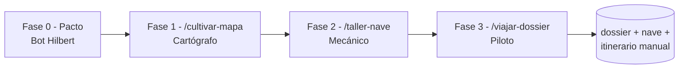

# Integración con ALEPH Scriptorium

> **Submódulo**: #18  
  "name": "@aleph-scriptorium/agent-lore-sdk",
  "version": "0.1.0",
  "description": "AGENT-TEMPLATES-1.0.0 + BOT-HILBERT-2.0.0",
> **Fecha integración**: 2026-06-04

Doble superficie AgentLoreSDK;

| Superficie | Rutas | Uso |
|---|---|---|
| **AGENT-TEMPLATES** | `cli-tool/components/**` | Catálogo de plantillas de agentes, commands, hooks, MCPs y skills para Scriptorium. |
| **BOT-HILBERT** | `general-definition.md`, `AGENTS.md`, `.github/**` | Cartógrafo de espacios temáticos con agentes, prompts, instructions, hooks y skills de VS Code Copilot. |


## Arquitectura del Submódulo AGENT-TEMPLATES-1.0.0

```
AgentLoreSDK/ nothing.zip
└── cli-tool/
    └── components/
        ├── agents/      # 25 categorías, 165 plantillas
        ├── commands/    # 20 categorías, 217 plantillas
        ├── skills/      # 10 categorías, 255 plantillas
        └── templates/   # 6 lenguajes (go, java, js, python, ruby, rust)
```

**Total**: 61 categorías, 637+ plantillas

### Tecnologías

- Markdown templates
- YAML frontmatter para metadatos
- Compatible con Claude Code / Copilot

### Mapeo Ontológico

| AgentLoreSDK | Scriptorium |
|--------------|-------------|
| `agents/` | @plugin_ox_agentcreator (detección proactiva) |
| `commands/` | Handoffs de agentes creados |
| `skills/` | Capacidades fusionables |
| `templates/` | Scaffolding de proyectos |

### Integración con Agent Creator DE LA SUITE SCRIPTORIUM (solo disponible si esta codebase está conectada al Scriptorium)

El plugin `agent-creator` usa este submódulo para:

1. **Detección Proactiva DRY** (Paso 1.5 de `crear-agente.prompt.md`)
2. **Índice navegable** en `.github/plugins/agent-creator/index/catalog.json`
3. **Fusión de plantillas** con agentes base del Scriptorium

#### Flujo de Uso

```
Usuario: "Quiero crear agente de seguridad"
              │
              ▼
Agent Creator detecta keywords → "security"
              │
              ▼
Consulta catalog.json → agents/security/ (5 items)
              │
              ▼
Sugiere proactivamente → Usuario elige
              │
              ▼
Fusiona plantilla con @blueflag (o base elegida)
```

---

### Dependencias Externas

- Ninguna (solo archivos Markdown)

---

### Supuestos y Gaps

| Gap | Descripción | Estado |
|-----|-------------|--------|
| G1 | Algunas plantillas pueden estar incompletas | Aceptado |
| G2 | Tags inferidos del nombre de carpeta | Funcional |
| G3 | Sin script de regeneración automática de catalog.json | Pendiente |

---

### Referencias

- **Fuente**: [escrivivir-co/mcp-agent-lore-sdk](https://github.com/escrivivir-co/mcp-agent-lore-sdk)
- **Plugin**: `.github/plugins/agent-creator/`
- **Índice**: `.github/plugins/agent-creator/index/catalog.json`
- **Sesión**: `ARCHIVO/DISCO/SESIONES_COTRABAJO/2026-01-04_agent-creator-claude-templates/`


## Arquitectura del Submódulo BOT-HILBERT-2.0.0

.github/copilot-instructions.md

La canónica vive en [general-definition.md](general-definition.md). El `AGENTS.md` enlaza sus anclas y registra los artefactos vivos de la sede. El bloque v2.0.0 trae estos modos:

- **Biblioteca**: crea o extiende dossiers `dossier-<tema>-v00-<tag>/`.
- **Parking/Taller**: navega dossiers existentes y registra itinerarios.
- **Volátil**: respuesta cartográfica volátil en chat.

Validación de anclas canónicas:

```bash
npm run validate
```

### Showcase

Dado un material en archivo, seleccionar el @Bot Hilbert o su spec: .github/agents/bot-hilbert.agent.md y prompt:

```
Diséñame una sesión en esta codebase para convertir mi ARCHIVO/yo-no-soy-yo-propositions-engine en mapas y una nave para navegarlo. Tipo manual de hands on de este producto que como usuario usaré.
```

#### Bot Hilbert - panel

**Archivo abierto**: yo-no-soy-yo-propositions-engine → semilla para cristalizar **dossier-mapa + nave**.

**Material disponible**

- Crudo v1: yo-no-soy-yo-propositions-engine (context.md, dos `*-cartografia.md`, 4 PNG)

- Plan de migración ya redactado: MIGRATION-v1-to-v2.md

- Prototipo paradigmático en yo-no-soy-yo-propositions-engine (ya define el tipo de mapa `yo-no-soy-yo` con capa de forks `⊢ ⊬ ⊘ ⥱ ⟲ ≈`)

**Señal de cristalización**: explícita --- "convertir en mapas y nave". Activa cristalizador en **dos niveles**: `mapa` (dossier) + `nave` (parking).

---

#### Diseño de la sesión hands-on

Cuatro fases, cada una con su handoff a un sub-agente. Tú detonas el handoff escribiendo el prompt; yo (Bot Hilbert) sólo orquesto y te devuelvo aquí entre fase y fase.

##### Fase 0 --- Pacto (esta ventana, conmigo)

Decisiones pendientes que **no tomo sin ti** (epoché):

| Decisión | Opción A | Opción B |

|---|---|---|

| **Punto de partida del dossier** | Partir de ARCHIVO crudo + MIGRATION (rehacer el mapa "limpio") | Adoptar yo-no-soy-yo-propositions-engine como semilla y refactorizar a dossier (más rápido) |

| **Tag del dossier** | `propositions-engine` (el del MIGRATION) | otro que prefieras |

| **Soporte literario del mapa** | `mapa.md` + `mapa.graph.json` (lo del MIGRATION) | añadir capa `forks.csv` para los marcadores `⊢ ⊬ ⊘ ⥱ ⟲ ≈` |

| **Frontera de la nave** | Visualizador HTML5 estático servido con `http-server` (genérica del parking, expresa para este dossier) | Algo más rico (D3, Cytoscape) --- más coste de scrum |

| **Ubicación de la nave** | `dossier-*/naves/thread-eigenstate-viewer/` (nace expresa) | `parking/thread-eigenstate-viewer/` directamente (apuesta a que servirá a más dossiers) |

| **Destino de yo-no-soy-yo-propositions-engine** | conservar tal cual (es archivo) | mover a `.meta/fuente-v1/` del dossier una vez importado |

##### Fase 1 --- Biblioteca - construir el dossier

**Handoff**: `@bot-biblioteca /cultivar-mapa`

Entregables esperables:

- `dossier-yo-no-soy-yo-v00-propositions-engine/mapa.md` (cartografía consolidada de Thread 1 + Thread 2 + puentes)

- `mapa.graph.json` con nodos `thread | eigenstate | source | bridge` y aristas `contains | references | corrects | bridges`

- `assets/*.png` (4 imágenes copiadas)

- `.meta/manifest.md` con firma, tipo de mapa (`yo-no-soy-yo`), leyenda de forks, modelo-lente

- `itinerarios/` vacío

Punto de parada para revisión tuya antes de Fase 2.

##### Fase 2 --- Taller - construir la nave

**Handoff**: `@bot-taller /taller-nave`

Scrum mínimo propuesto:

1\. Esqueleto: `index.html` + `viewer.js` + `style.css` + `README.md` + `.meta/manifest.md`

2\. Loader de `mapa.graph.json` con `fetch()` relativo

3\. Render de grafo (fuerza simple en canvas o `<svg>` plano --- sin dependencias pesadas para el v00)

4\. Panel lateral aleph: toggles para capas `thread-1 | thread-2 | bridges | forks-rechazados`

5\. Click en nodo → ficha con cita y enlace a la fuente (context.md o X)

6\. Servidor: `npx http-server -p 8080` desde la raíz de la nave

Punto de parada antes de Fase 3.

##### Fase 3 --- Garaje + pista - manual de uso (lo que pediste como "hands on")

**Handoff**: `@bot-parking /viajar-dossier`

Aquí no se construye nada. Yo (en piloto) te llevo en un viaje guiado del producto recién hecho, como si fuera la primera vez que lo abres:

1\. Levantar la nave (`http-server`) y abrir el visualizador.

2\. Recorrido 1 --- **Lectura inicial**: Thread 1 completo, eigenstates en orden de aparición.

3\. Recorrido 2 --- **Capa de forks**: activar solo `⊬` y `⥱` para ver el conflicto de filiación Marx/marxismo.

4\. Recorrido 3 --- **Puentes Thread 1 ↔ Thread 2**: cómo "Marx no era marxista" se cuela en el debate sobre Estado.

5\. Cierre: guardar el recorrido en `itinerarios/manual-primera-visita.md` (el único sitio donde el piloto puede escribir).

Resultado final: tienes un **manual de uso vivo** del producto, escrito en clave de bitácora de viaje, que cualquier visitante futuro (humano o modelo) puede releer.

---

### Mapa-resumen de la sesión



---

### Para continuar

Necesito tu epoché sobre las **seis decisiones de la Fase 0** (al menos las dos primeras: partida y tag). Cuando me las cierres, abro Fase 1 con el handoff a `@bot-biblioteca`.

Si prefieres, también puedo:

- **(a)** preparar los seis defaults razonables y tú solo me dices "ok" o tocas lo que quieras,

- **(b)** convertir este plan en un `itinerarios/` adelantado (snapshot del plan, sin ejecutar nada) para que sobreviva al cambio de sub-agente.

## Contribuir

Ver [CONTRIBUTING.md](CONTRIBUTING.md).

## Licencia

Este bloque hereda la [Animus Iocandi Public License](LICENSE.md) de Aleph Scriptorium.